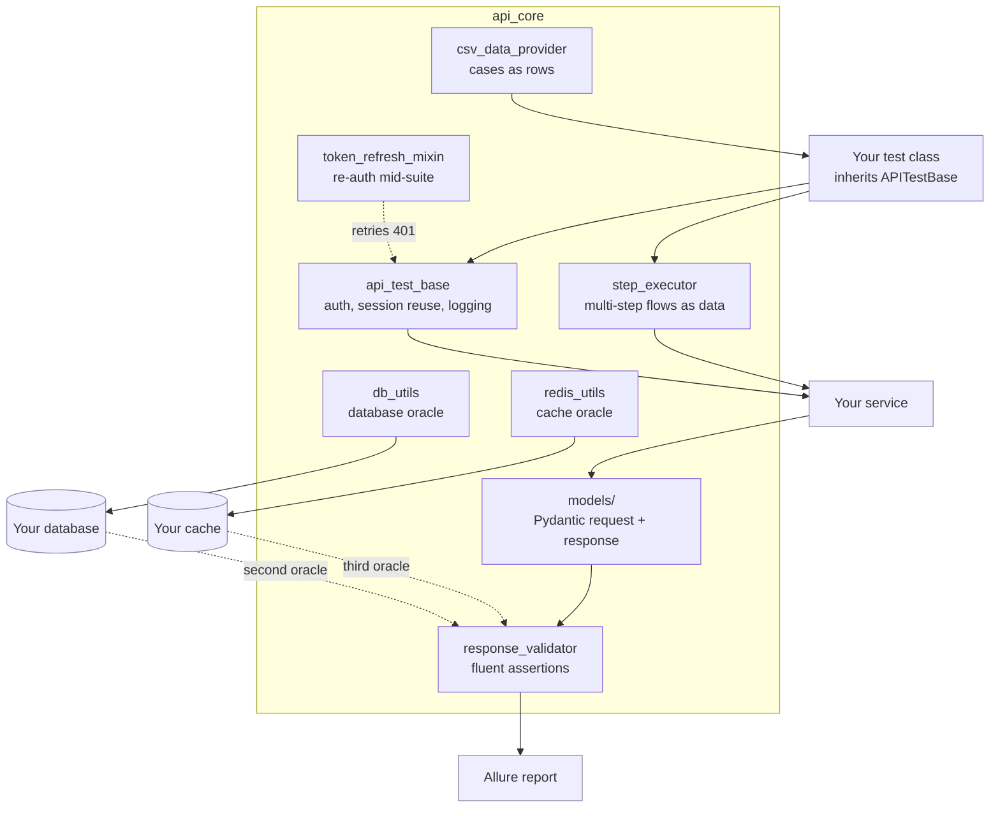

# pytest-api-harness


CI runs the demo stack and fails on a skipped test, then removes the cache
eviction from the service and fails unless the oracle catches it. The badge is
about the oracle, not only about lint.

The reusable half of a production API test suite: base classes, typed request
and response models, a declarative step executor, response validators, CSV data
providers, and token refresh handling.

It is the scaffolding, not the tests. You bring the endpoints.

## The argument, run as an experiment

Delete the one line in `demo/app.py` that evicts a cached order after its
status changes, then rerun the suite:

```
tests/demo/test_design_techniques.py    44 passed
tests/demo/test_oracles.py               1 failed
```

44 tests that read only the API pass while the service serves a stale
`created` to every reader and the database says `paid`. The API is perfectly
consistent with itself, so nothing at the response layer can see it. The cache
oracle fails in the first second and names the key.

That is why a response assertion is not an oracle. [Full write-up
below](#what-the-demo-proves).

## What it gives you

**`api_core/core/api_test_base.py`** — the base class every test inherits.
Handles auth, session reuse, request logging and the boilerplate that otherwise
gets copy-pasted into three hundred test files and drifts.

**`api_core/core/step_executor.py`** — multi-step flows declared as data rather
than nested Python. A subscription purchase is six calls where each depends on
the last; written imperatively that becomes unreadable, and unreadable tests get
deleted rather than fixed.

**`api_core/models/`** — Pydantic request and response models. A schema change
then breaks at parse time with a field name, instead of surfacing as
`KeyError: None` somewhere in an assertion twenty lines later.

**`api_core/utils/response_validator.py`** — fluent assertions over a response:
status, field presence, types, regex, nested paths. Failures name the field and
show what arrived.

**`api_core/utils/csv_data_provider.py`** — data-driven cases from CSV, so
adding a boundary case is a row rather than a code change. Non-engineers on a QA
team can extend coverage without touching Python.

**`api_core/utils/token_refresh_mixin.py`** — transparent re-auth when a token
expires mid-suite. Long suites otherwise fail somewhere in the middle for a
reason that has nothing to do with the code under test.

**`api_core/utils/db_utils.py`** — a database client for oracle checks.

**`api_core/utils/redis_utils.py`** — a cache oracle. Asserts that an entry was
populated, that it carries a TTL rather than living forever, and that it was
evicted when the underlying row changed. Cache staleness is invisible to any
test that only reads the API.

## How a test is assembled



The database path is the part most suites leave out, and it is the reason the
next section exists.

## On oracles, which is the point

A `200 OK` is the weakest evidence a test can collect. It says the service
accepted the request, not that it did the thing.

So the pattern this harness is built around is: assert the response, then
independently verify the effect. Payment returns success, and the ledger row
exists with the right amount. Subscription activates, and the entitlement is
readable from the profile service. Two sources, and they have to agree.

`db_utils.py` exists for that second check. Use a read-only role for it. When
the two disagree, that disagreement is the finding, and the fix is never to
weaken the assertion until it passes.

## Setup

```bash
pip install -r requirements.txt
cp .env.example .env
```

`BASE_URL` is required and has no default. A default base URL means a suite that
silently passes against the wrong environment, which is worse than one that
refuses to start.

```bash
pytest -m smoke
```

## Wiring it to your service

The harness ships no clients and no endpoint registry, because those are the
parts that are specific to your API. Subclass the base, point it at your
service, and put your own fixtures in your own `conftest.py`.

`api_core/models/requests/auth.py` and the matching response model are included
as worked examples of the shape a model should take.

## Run it against the demo stack

The harness ships a small target service so the oracle argument above can be
demonstrated rather than asserted: a FastAPI order service, Postgres behind it,
Redis in front of it. No account, no network, no shared environment.

```bash
docker compose -f demo/docker-compose.yml up -d
pytest tests/demo                     # 50 tests
```

The service has three properties chosen to make oracles meaningful. Writes land
in Postgres, so a `201` can be checked against a row. Reads are cached in Redis
with a TTL, and a status change evicts the key. Status changes follow a state
machine, so illegal moves are refused with `409` instead of silently accepted.

### What the demo proves

Delete one line from `demo/app.py` -- the `_redis.delete(...)` that evicts a
cached order after its status changes -- and rerun:

```
tests/demo/test_design_techniques.py    44 passed
tests/demo/test_oracles.py               1 failed
```

Every test that reads only the API still passes. The service is serving a stale
`created` to every reader while the database says `paid`, and the API is
perfectly consistent with itself, so nothing at the response layer can see it.
The cache oracle fails in the first second and names the key.

That is the entire argument for a second and third source, run as an experiment
rather than claimed in a README.

### The experiment runs in CI

`tools/mutation_check.sh` performs that deletion on every push. It removes the
eviction call, rebuilds the service, and requires two things: the API-only file
still passes, and the oracle file fails. If the oracle passes with the bug in
place, it has stopped testing anything and the build goes red.

```bash
bash tools/mutation_check.sh
```

The mutation is reverted on exit, including on failure.

This exists because the badge above used to be worth very little. Every run
between the first release and this change reported `19 passed, 50 skipped`. The
demo directory skips itself when its stack is not up, which is correct on a
laptop and wrong on a runner, where docker is available and nothing was
forgotten. Fifty tests, the cache oracle among them, had never executed, and a
badge cannot show the difference between nothing skipped and everything skipped.
`tools/demo_suite.sh` now brings the stack up and treats any skip as a failure.

## Test design, named

`tests/demo/test_design_techniques.py` applies the standard black-box
techniques, one class each, because naming them turns "we wrote some tests" into
a coverage argument that survives a review:

| technique | what it covers here |
|---|---|
| Equivalence partitioning | one case per input class, not fifty from one class |
| Boundary value analysis | quantity 0/1/2 and 99/100/101, price 0/1/1000000/1000001 |
| Decision table | auth x payload validity, including that 401 beats 422 |
| State transition | 5 legal moves accepted, 5 illegal moves refused |
| Error guessing | empty bodies, floats, nulls, over-length fields |

The decision-table row worth reading is the unauthenticated-and-invalid case. It
pins the *order* of the checks: replying `422` to a caller who never
authenticated tells them which payloads are valid.

The state-transition tests assert the database too. A `409` that still mutated
the row is worse than either failure alone, and only the second oracle sees it.

## Scope

The harness ships the base class, models, validators, and the database and cache
oracles. The demo stack exists to exercise them; your own suite points the same
utilities at your own service. It does not ship service clients or an endpoint
registry for your API -- those are specific to you.

## License

MIT. See [LICENSE](LICENSE).
